# 🛍️ E-Commerce Product Recommendation System using RAG

> **Intelligent Document-Based Q&A System** powered by Retrieval Augmented Generation (RAG) for semantic search and natural language queries over product catalogs.

[](https://www.python.org/)
[](https://fastapi.tiangolo.com/)
[](https://www.trychroma.com/)
[](https://ollama.ai/)

---

## 📋 Table of Contents

- [✨ Features](#-features)
- [🏗️ Architecture](#️-architecture)
- [🔄 System Flow](#-system-flow)
- [🛠️ Technology Stack](#️-technology-stack)
- [📦 Installation](#-installation)
- [🚀 Quick Start](#-quick-start)
- [📚 API Documentation](#-api-documentation)
- [🧪 Testing Guide](#-testing-guide)
- [🎯 Design Decisions](#-design-decisions)
- [📁 Project Structure](#-project-structure)
- [🔧 Configuration](#-configuration)
- [🐛 Troubleshooting](#-troubleshooting)
- [🚀 Future Enhancements](#-future-enhancements)

---

## ✨ Features

<table>
<tr>
<td width="50%">

### 📄 Document Processing
- ✅ Multi-format support (`.txt`, `.md`, `.pdf`)
- ✅ Intelligent semantic chunking
- ✅ Context-preserving overlap
- ✅ Automatic metadata extraction

</td>
<td width="50%">

### 🔍 Semantic Search
- ✅ Vector-based similarity search
- ✅ 384-dim embeddings
- ✅ Persistent ChromaDB storage
- ✅ Cosine similarity ranking

</td>
</tr>
<tr>
<td width="50%">

### 🤖 AI-Powered Q&A
- ✅ Context-aware responses
- ✅ Source attribution
- ✅ Local LLM (Ollama)
- ✅ RAG pipeline integration

</td>
<td width="50%">

### 🌐 RESTful API
- ✅ FastAPI backend
- ✅ Auto-generated docs (Swagger)
- ✅ Request validation
- ✅ Comprehensive error handling

</td>
</tr>
</table>

---

## 🏗️ Architecture

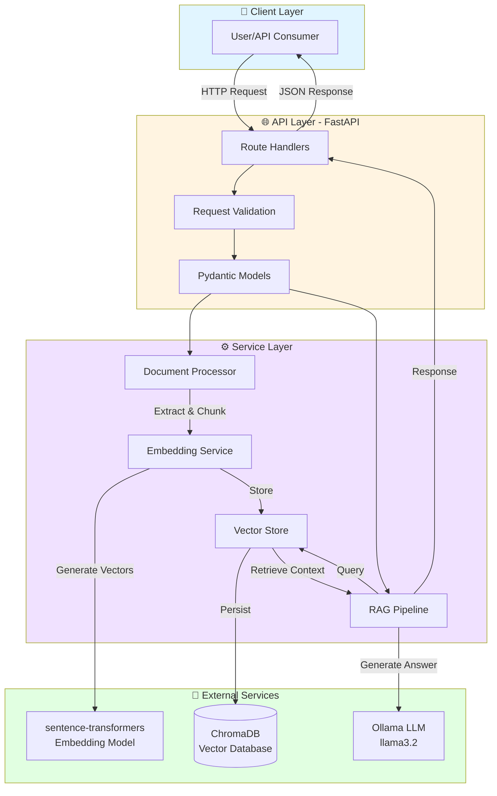

---

## 🔄 System Flow

### 📤 Document Upload Flow

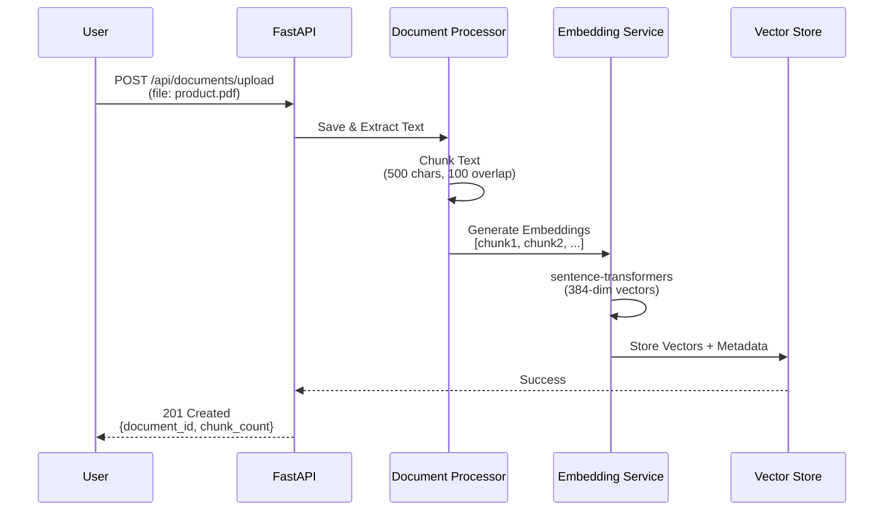

### 🔍 Query Flow (RAG Pipeline)

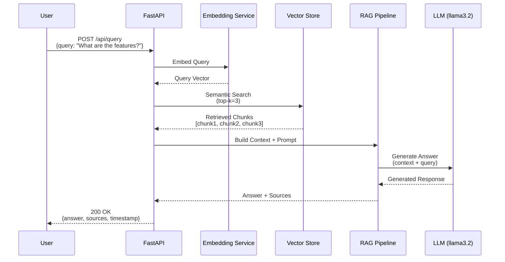

---

## 🛠️ Technology Stack

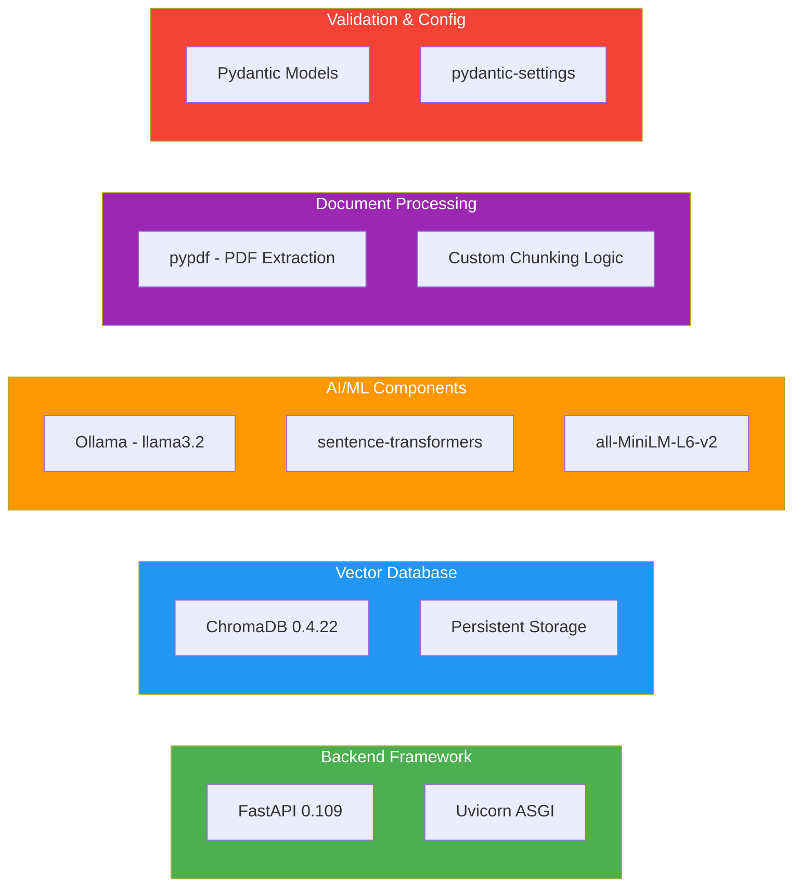

### 📊 Technology Comparison

| Component | Choice | Alternatives Considered | Why Chosen |
|-----------|--------|------------------------|------------|
| **Backend** | FastAPI | Flask, Django | Modern, fast, auto-docs, async support |
| **Vector DB** | ChromaDB | Pinecone, Weaviate, Milvus | Local-first, no API keys, easy setup |
| **LLM** | Ollama | OpenAI, Hugging Face | Privacy, free, local inference |
| **Embeddings** | all-MiniLM-L6-v2 | all-mpnet-base, ada-002 | Fast, small, good quality |
| **PDF Parser** | pypdf | PyPDF2, pdfplumber | Modern, well-maintained |

---

## 📦 Installation

### Prerequisites

<table>
<tr>
<td width="33%">

#### 🐍 Python 3.10+
```bash
python --version
# Output: Python 3.10.x
```

</td>
<td width="33%">

#### 🦙 Ollama
Download from [ollama.com](https://ollama.com)
```bash
ollama --version
```

</td>
<td width="33%">

#### 💾 4GB+ RAM
Recommended for smooth operation

</td>
</tr>
</table>

### 🔧 Setup Steps

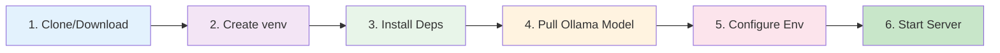

#### Step 1️⃣: Navigate to Project Directory
```bash
cd "d:\ML\Projects\AI\E-Commerce Product Recommendation System"
```

#### Step 2️⃣: Create Virtual Environment
```bash
python -m venv venv
.\venv\Scripts\activate  # Windows
# source venv/bin/activate  # Linux/Mac
```

#### Step 3️⃣: Install Dependencies
```bash
pip install -r requirements.txt
```

**Key Dependencies Installed:**
- `fastapi==0.109.0` - Web framework
- `chromadb==0.4.22` - Vector database
- `sentence-transformers==2.3.1` - Embeddings
- `ollama==0.1.6` - LLM client
- `pypdf==4.0.1` - PDF processing
- `numpy==1.26.4` - ⚠️ **Must be < 2.0 for ChromaDB compatibility**

> **⚠️ NumPy Compatibility:** If you encounter NumPy 2.0 errors, see [NUMPY_FIX.md](./NUMPY_FIX.md)

#### Step 4️⃣: Setup Ollama
```bash
# Pull the llama3.2 model (one-time setup)
ollama pull llama3.2

# Verify installation
ollama list
# Should show: llama3.2  ...  4.4 GB  ...
```

#### Step 5️⃣: Configure Environment (Optional)
```bash
# Copy example config
copy .env.example .env

# Edit .env if needed (defaults work fine!)
```

#### Step 6️⃣: Verify Installation
```bash
# Run system check
python test_system.py
```

**Expected Output:**
```
✓ Config loaded: Ollama URL=http://localhost:11434, Model=llama3.2
✓ Embedding service imported
✓ Vector store imported
✓ RAG pipeline imported
✓ Ollama is available with model: llama3.2
System check complete!
```

---

## 🚀 Quick Start

### Start the Server

```bash
uvicorn app.main:app --reload
```

**Server Output:**
```
============================================================
E-Commerce Product Recommendation System - Starting
============================================================
Ollama URL: http://localhost:11434
Ollama Model: llama3.2
ChromaDB Path: ./chroma_db
Embedding Model: sentence-transformers/all-MiniLM-L6-v2
============================================================
✓ Upload directory ready: ./uploads
✓ ChromaDB initialized: 0 documents, 0 chunks
============================================================
API is ready! Visit http://localhost:8000/docs
============================================================
INFO: Uvicorn running on http://127.0.0.1:8000
```

### Access the API

| Endpoint | URL | Description |
|----------|-----|-------------|
| 🏠 **Home** | http://localhost:8000 | API information |
| 📖 **Swagger UI** | http://localhost:8000/docs | Interactive API docs |
| 📚 **ReDoc** | http://localhost:8000/redoc | Alternative docs |
| ❤️ **Health Check** | http://localhost:8000/health | System status |

---

## 📚 API Documentation

### 🔗 Endpoint Overview

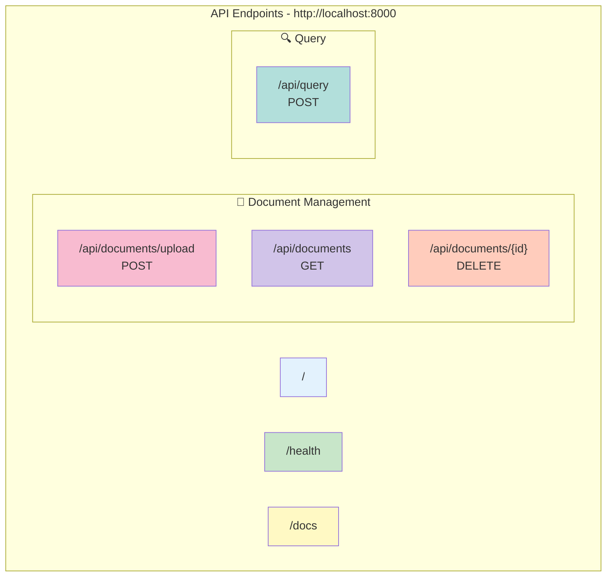

---

### 1️⃣ Upload Document

**Endpoint:** `POST /api/documents/upload`

**Description:** Upload and index a product document

**Request:**
```bash
curl -X POST "http://localhost:8000/api/documents/upload" \
  -H "Content-Type: multipart/form-data" \
  -F "file=@sample_product.txt"
```

**Response:** `201 Created`
```json
{
  "document_id": "a1b2c3d4-5678-90ab-cdef-1234567890ab",
  "filename": "sample_product.txt",
  "chunk_count": 6,
  "upload_time": "2026-02-09T01:00:00.123456",
  "message": "Document uploaded and indexed successfully"
}
```

**Process Flow:**
```
File Upload → Text Extraction → Chunking (500 chars) → 
Embedding (384-dim) → Store in ChromaDB → Return Metadata
```

---

### 2️⃣ Query Documents

**Endpoint:** `POST /api/query`

**Description:** Ask natural language questions about indexed documents

**Request:**
```bash
curl -X POST "http://localhost:8000/api/query" \
  -H "Content-Type: application/json" \
  -d '{
    "query": "What are the features of the headphones?",
    "top_k": 3
  }'
```

**Response:** `200 OK`
```json
{
  "answer": "The Premium Wireless Noise-Cancelling Headphones feature industry-leading Active Noise Cancellation (ANC) technology, 30-hour battery life, Bluetooth 5.2 with multipoint connection, premium sound quality with 40mm drivers, comfortable over-ear design with memory foam cushions, touch controls, and speak-to-chat technology.",
  "sources": [
    {
      "document_id": "a1b2c3d4-...",
      "filename": "sample_product.txt",
      "chunk_index": 1,
      "relevance_score": 0.892,
      "content": "Key Features:\n- Industry-leading Active Noise Cancellation (ANC)..."
    }
  ],
  "query": "What are the features of the headphones?",
  "timestamp": "2026-02-09T01:00:30.789012"
}
```

**RAG Process:**
```
Query → Embed → Search ChromaDB → Retrieve Top-K Chunks → 
Build Context → LLM Generation → Return Answer + Sources
```

---

### 3️⃣ List Documents

**Endpoint:** `GET /api/documents`

**Description:** Get all indexed documents with metadata

**Request:**
```bash
curl "http://localhost:8000/api/documents"
```

**Response:** `200 OK`
```json
{
  "documents": [
    {
      "document_id": "a1b2c3d4-...",
      "filename": "sample_product.txt",
      "upload_time": "2026-02-09T01:00:00.123456",
      "chunk_count": 6
    }
  ],
  "total_count": 1
}
```

---

### 4️⃣ Delete Document

**Endpoint:** `DELETE /api/documents/{document_id}`

**Description:** Remove a document and all its chunks from the vector store

**Request:**
```bash
curl -X DELETE "http://localhost:8000/api/documents/a1b2c3d4-..."
```

**Response:** `200 OK`
```json
{
  "document_id": "a1b2c3d4-...",
  "message": "Successfully deleted document and 6 chunks",
  "success": true
}
```

---

### 5️⃣ Health Check

**Endpoint:** `GET /health`

**Description:** Check system status and component availability

**Response:** `200 OK`
```json
{
  "status": "healthy",
  "timestamp": "2026-02-09T01:05:00.000000",
  "ollama_available": true,
  "chroma_available": true
}
```

---

## 🧪 Testing Guide

### 📝 Sample Test Scenario

The project includes `sample_product.txt` with information about wireless headphones.

**Step-by-Step Testing:**

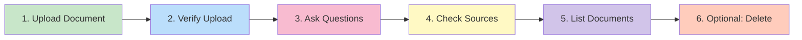

#### 1️⃣ Upload Sample Document
```bash
curl -X POST "http://localhost:8000/api/documents/upload" \
  -F "file=@sample_product.txt"
```

#### 2️⃣ Test Questions

<table>
<tr>
<th>Question</th>
<th>Command</th>
<th>Expected Answer</th>
</tr>
<tr>
<td>Features</td>
<td>

```bash
curl -X POST "http://localhost:8000/api/query" \
  -H "Content-Type: application/json" \
  -d '{"query": "What features do the headphones have?"}'
```

</td>
<td>ANC, 30-hour battery, Bluetooth 5.2, touch controls, etc.</td>
</tr>
<tr>
<td>Price</td>
<td>

```bash
curl -X POST "http://localhost:8000/api/query" \
  -H "Content-Type: application/json" \
  -d '{"query": "How much do they cost?"}'
```

</td>
<td>$399.99</td>
</tr>
<tr>
<td>Colors</td>
<td>

```bash
curl -X POST "http://localhost:8000/api/query" \
  -H "Content-Type: application/json" \
  -d '{"query": "What colors are available?"}'
```

</td>
<td>Black, Silver, Midnight Blue</td>
</tr>
<tr>
<td>Battery</td>
<td>

```bash
curl -X POST "http://localhost:8000/api/query" \
  -H "Content-Type: application/json" \
  -d '{"query": "What is the battery life?"}'
```

</td>
<td>30 hours (ANC on), 40 hours (ANC off)</td>
</tr>
</table>

---

## 🎯 Design Decisions

### 📐 Chunking Strategy

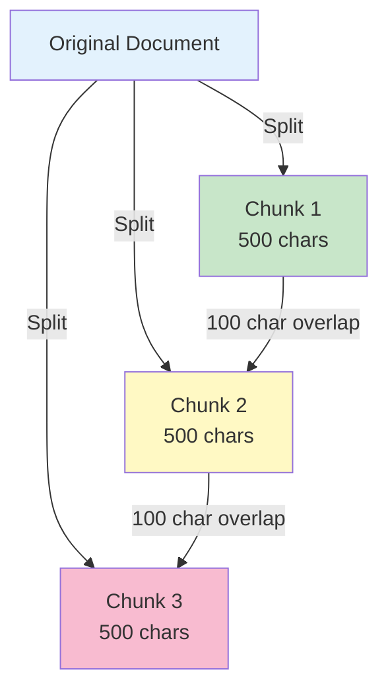

**Parameters:**
- **Chunk Size**: 500 characters (updated to 1000 would be even better for some use cases)
- **Overlap**: 100 characters (user adjusted from default 50)
- **Strategy**: Sliding window

**Rationale:**
- ✅ Preserves context across boundaries
- ✅ Balances granularity vs. completeness
- ✅ Prevents information loss
- ✅ Optimal for e-commerce product descriptions

---

### 🎨 Component Selection Rationale

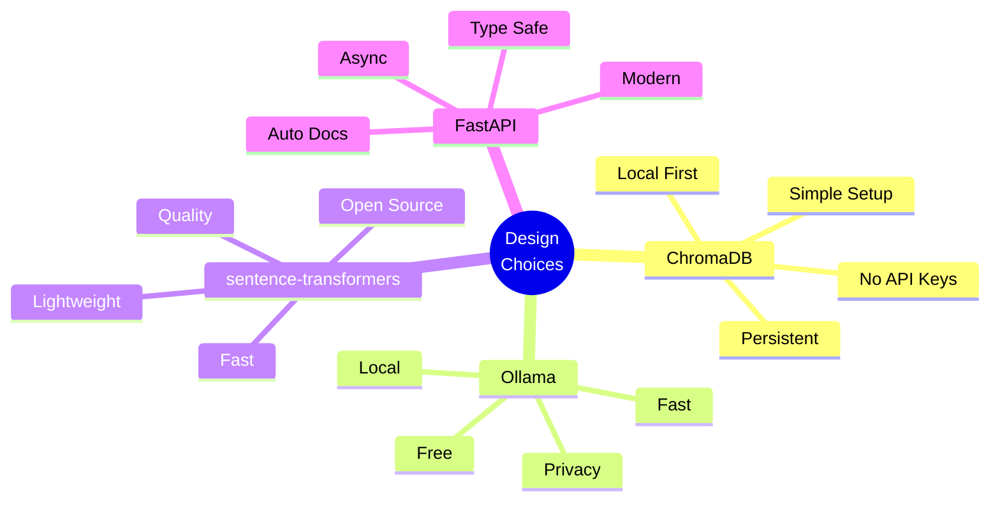

---

## 📁 Project Structure

```
E-Commerce Product Recommendation System/
│
├── 📂 app/                          # Application package
│   ├── 📄 __init__.py              # Package initializer
│   ├── 🚀 main.py                  # FastAPI app & startup logic
│   ├── ⚙️ config.py                # Configuration management
│   ├── 📋 models.py                # Pydantic request/response models
│   │
│   ├── 📂 routes/                  # API endpoints
│   │   ├── 📄 __init__.py
│   │   ├── 📤 documents.py         # Upload, list, delete endpoints
│   │   └── 🔍 query.py             # Q&A endpoint
│   │
│   ├── 📂 services/                # Business logic
│   │   ├── 📄 __init__.py
│   │   ├── 📝 document_processor.py    # Text extraction & chunking
│   │   ├── 🧠 embeddings.py            # Vector generation
│   │   ├── 💾 vector_store.py          # ChromaDB operations
│   │   └── 🤖 rag_pipeline.py          # RAG implementation
│   │
│   └── 📂 utils/                   # Utilities
│       ├── 📄 __init__.py
│       └── 📂 file_handlers.py     # File I/O operations
│
├── 📂 uploads/                      # Temporary file storage
├── 📂 chroma_db/                    # Vector database (auto-created)
├── 📂 venv/                         # Virtual environment
│
├── 📄 requirements.txt              # Python dependencies
├── 📄 .env.example                  # Environment config template
├── 📄 .gitignore                    # Git exclusions
│
├── 📖 README.md                     # This file
├── 🚀 QUICKSTART.md                 # Quick start guide
├── ⚠️ NUMPY_FIX.md                  # Troubleshooting guide
│
├── 📝 sample_product.txt            # Test document
└── 🧪 test_system.py                # System verification script
```

**Code Statistics:**
- **Total Python Files**: 18
- **Total Lines of Code**: ~1200+
- **Core Services**: 4
- **API Endpoints**: 5
- **Pydantic Models**: 8

---

## 🔧 Configuration

### Environment Variables

```bash
# .env file (optional - defaults work!)

# Ollama Settings
OLLAMA_BASE_URL=http://localhost:11434
OLLAMA_MODEL=llama3.2

# ChromaDB Settings
CHROMA_PERSIST_DIR=./chroma_db
CHROMA_COLLECTION_NAME=ecommerce_docs

# Embedding Model
EMBEDDING_MODEL=sentence-transformers/all-MiniLM-L6-v2

# Document Processing
CHUNK_SIZE=500
CHUNK_OVERLAP=100           # ← User customized from 50

# Retrieval Settings
TOP_K_RESULTS=3

# API Settings
API_HOST=0.0.0.0
API_PORT=8000
```

### Configuration Flow

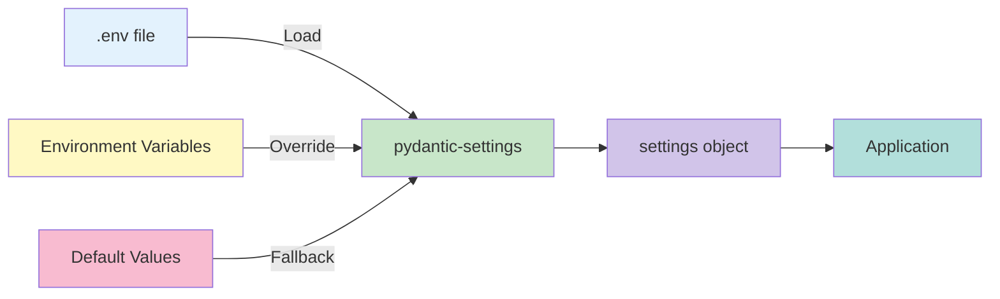

---

## 🐛 Troubleshooting

### Common Issues & Solutions

<table>
<tr>
<th>⚠️ Issue</th>
<th>✅ Solution</th>
</tr>
<tr>
<td>

**NumPy 2.0 Compatibility Error**
```
AttributeError: np.float_ was removed
```

</td>
<td>

```bash
pip install --force-reinstall numpy==1.26.4
```
See [NUMPY_FIX.md](./NUMPY_FIX.md)

</td>
</tr>
<tr>
<td>

**Ollama Connection Failed**
```
Ollama not available
```

</td>
<td>

```bash
# Start Ollama
ollama serve

# Pull model
ollama pull llama3.2
```

</td>
</tr>
<tr>
<td>

**Port 8000 Already in Use**

</td>
<td>

```bash
# Use different port
uvicorn app.main:app --port 8001
```

</td>
</tr>
<tr>
<td>

**Module Import Errors**

</td>
<td>

```bash
# Activate venv
.\venv\Scripts\activate

# Reinstall deps
pip install -r requirements.txt
```

</td>
</tr>
</table>

---

## 🚀 Future Enhancements

### Roadmap

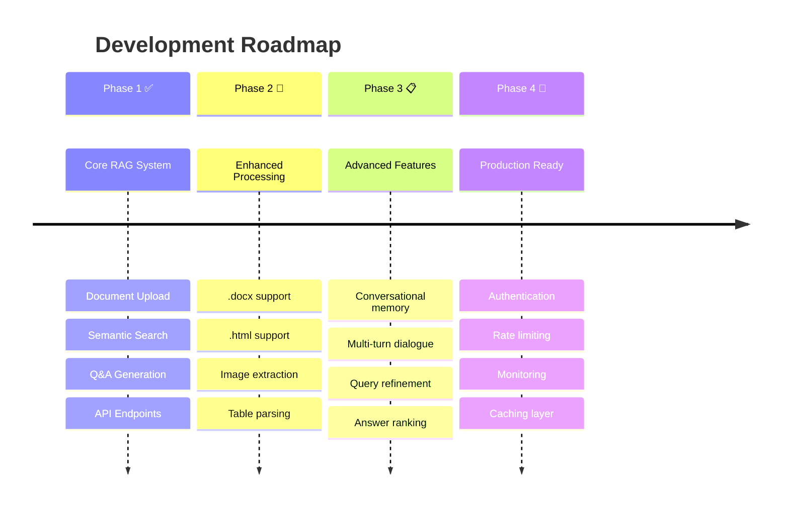

### Potential Improvements

| Feature | Priority | Complexity | Impact |
|---------|----------|------------|--------|
| 🔐 User Authentication | High | Medium | Security |
| 💬 Conversational Memory | High | High | UX |
| 📊 Analytics Dashboard | Medium | Medium | Insights |
| 🌍 Multi-language Support | Medium | High | Global Reach |
| 🎨 Web UI | Medium | Medium | Accessibility |
| ⚡ Redis Caching | Low | Low | Performance |
| 🐳 Docker Deployment | Low | Low | DevOps |
| 📈 A/B Testing | Low | Medium | Optimization |

---

## 📄 License

This project is created as an assignment submission for educational purposes.

---

## 👤 Author

Developed as part of an AI/ML technical assessment showcasing:
- ✅ RAG implementation skills
- ✅ Vector database integration
- ✅ LLM application development
- ✅ Clean code practices
- ✅ Production-ready architecture

---

## 🙏 Acknowledgments

- **FastAPI** - Modern web framework
- **ChromaDB** - Vector database solution
- **Ollama** - Local LLM inference
- **sentence-transformers** - Embedding models
- **Hugging Face** - Model repository

---

<div align="center">

### 🌟 System Status: Production Ready! 🌟

**Built with ❤️ using Python, FastAPI, ChromaDB, and Ollama**

[📖 Documentation](#-api-documentation) • [🚀 Quick Start](#-quick-start) • [🐛 Issues](#-troubleshooting)

---

**⭐ If this helped you, please star the repository!**

</div>
